# 作品图片命名与来源核对

整理日期：2026-09-30。输入：用户提供的 `alex-webb/` 目录，共 35 张（9 张 JPEG、26 张 WebP）。上传位置：`video/public/photos/`。

## 核对结果

- 27 张：找到同图网页，按摄影师官网、Magnum、代理画廊或馆藏记录确认。
- 5 张：原图元数据明确作者、地点和年份，项目背景已有联网来源，但尚未找到同图公开页面（03、04、06、07、08）。
- 3 张：作者、地点和年份待核实（25、26、32）。已分别检索，暂按画面内容命名。
- 05 的作者是 **Rebecca Norris Webb**；其余已确认作者的 31 张为 Alex Webb。

## 命名与证据说明

文件名采用 `编号-作者-地点-拍摄年份-画面描述.原扩展名`；待核实图片采用 `编号-unverified-画面描述.webp`。中文名称和文件名中的画面描述用于检索识别，并非声称摄影师为作品赋予了这些正式题名。年份指拍摄年份，不是摄影集出版、印制或文件修改年份。

“同图确认”基于视觉比对和来源说明；“项目背景”只说明拍摄项目，不能证明该网页刊登了该图片；待核实条目的链接仅记录检索范围，不能当作归属证据。

所有上传图片均从用户原文件直接复制，未裁切、调色、压缩或清除元数据。每张的 SHA-256 已与原文件校验一致。来源页面用于核对作品信息，不表示用户文件最初从该网页下载，也不表示版权转移。

## 文件索引

| 编号 | 新文件名 | 作者 | 地点 / 年份 | 核对状态 |
|---|---|---|---|---|
| 01 | [01-alex-webb-istanbul-turkey-2004-grounded-ship.jpeg](../video/public/photos/01-alex-webb-istanbul-turkey-2004-grounded-ship.jpeg) | Alex Webb | 伊斯坦布尔，土耳其 / 2004 | 同图确认 |
| 02 | [02-alex-webb-ciudad-madero-mexico-1983-pool.jpeg](../video/public/photos/02-alex-webb-ciudad-madero-mexico-1983-pool.jpeg) | Alex Webb | Ciudad Madero，墨西哥 / 1983 | 同图确认 |
| 03 | [03-alex-webb-rochester-new-york-2012-street.jpeg](../video/public/photos/03-alex-webb-rochester-new-york-2012-street.jpeg) | Alex Webb | 罗切斯特，纽约州，美国 / 2012 | 元数据确认；未找到同图网页 |
| 04 | [04-alex-webb-rochester-new-york-2013-downtown-morning.jpeg](../video/public/photos/04-alex-webb-rochester-new-york-2013-downtown-morning.jpeg) | Alex Webb | 罗切斯特，纽约州，美国 / 2013 | 元数据确认；未找到同图网页 |
| 05 | [05-rebecca-norris-webb-rochester-new-york-2013-passenger-pigeon-diorama.jpeg](../video/public/photos/05-rebecca-norris-webb-rochester-new-york-2013-passenger-pigeon-diorama.jpeg) | Rebecca Norris Webb | 罗切斯特科学博物馆，纽约州，美国 / 2013 | 同图确认 |
| 06 | [06-alex-webb-stanford-california-2015-bikers-near-quad.jpeg](../video/public/photos/06-alex-webb-stanford-california-2015-bikers-near-quad.jpeg) | Alex Webb | 斯坦福大学，加利福尼亚州，美国 / 2015 | 元数据确认；未找到同图网页 |
| 07 | [07-alex-webb-stanford-california-2015-quad.jpeg](../video/public/photos/07-alex-webb-stanford-california-2015-quad.jpeg) | Alex Webb | 斯坦福大学，加利福尼亚州，美国 / 2015 | 元数据确认；未找到同图网页 |
| 08 | [08-alex-webb-stanford-california-2015-university-band.jpeg](../video/public/photos/08-alex-webb-stanford-california-2015-university-band.jpeg) | Alex Webb | 斯坦福大学，加利福尼亚州，美国 / 2015 | 元数据确认；未找到同图网页 |
| 09 | [09-alex-webb-park-slope-brooklyn-2018-bubbles.jpeg](../video/public/photos/09-alex-webb-park-slope-brooklyn-2018-bubbles.jpeg) | Alex Webb | Park Slope，布鲁克林，纽约，美国 / 2018 | 同图确认 |
| 10 | [10-alex-webb-tehuantepec-mexico-1985-children.webp](../video/public/photos/10-alex-webb-tehuantepec-mexico-1985-children.webp) | Alex Webb | Tehuantepec，Oaxaca，墨西哥 / 1985 | 同图确认 |
| 11 | [11-alex-webb-nuevo-laredo-mexico-1996-registry-office.webp](../video/public/photos/11-alex-webb-nuevo-laredo-mexico-1996-registry-office.webp) | Alex Webb | Nuevo Laredo，Tamaulipas，墨西哥 / 1996 | 同图确认 |
| 12 | [12-alex-webb-gouyave-grenada-1979-bar.webp](../video/public/photos/12-alex-webb-gouyave-grenada-1979-bar.webp) | Alex Webb | Gouyave，格林纳达 / 1979 | 同图确认 |
| 13 | [13-alex-webb-tijuana-mexico-1991-shoeshine-mirror.webp](../video/public/photos/13-alex-webb-tijuana-mexico-1991-shoeshine-mirror.webp) | Alex Webb | Tijuana，Baja California，墨西哥 / 1991 | 同图确认 |
| 14 | [14-alex-webb-port-au-prince-haiti-1979-red-wall.webp](../video/public/photos/14-alex-webb-port-au-prince-haiti-1979-red-wall.webp) | Alex Webb | 太子港，海地 / 1979 | 同图确认 |
| 15 | [15-alex-webb-rochester-new-york-2013-dance-hall.webp](../video/public/photos/15-alex-webb-rochester-new-york-2013-dance-hall.webp) | Alex Webb | 罗切斯特，纽约州，美国 / 2013 | 同图确认 |
| 16 | [16-alex-webb-leon-mexico-1987-cardboard-box.webp](../video/public/photos/16-alex-webb-leon-mexico-1987-cardboard-box.webp) | Alex Webb | León，Guanajuato，墨西哥 / 1987 | 同图确认 |
| 17 | [17-alex-webb-rochester-new-york-2013-flying-squirrels.webp](../video/public/photos/17-alex-webb-rochester-new-york-2013-flying-squirrels.webp) | Alex Webb | Corn Hill，罗切斯特，纽约州，美国 / 2013 | 同图确认 |
| 18 | [18-alex-webb-rochester-new-york-2012-open-door-mission.webp](../video/public/photos/18-alex-webb-rochester-new-york-2012-open-door-mission.webp) | Alex Webb | Plymouth Street，罗切斯特，纽约州，美国 / 2012 | 同图确认 |
| 19 | [19-alex-webb-bombay-india-1981-eyes-banner.webp](../video/public/photos/19-alex-webb-bombay-india-1981-eyes-banner.webp) | Alex Webb | Bombay（现 Mumbai），印度 / 1981 | 同图确认 |
| 20 | [20-alex-webb-santo-domingo-dominican-republic-1980-boys.webp](../video/public/photos/20-alex-webb-santo-domingo-dominican-republic-1980-boys.webp) | Alex Webb | Santo Domingo，多米尼加共和国 / 1980 | 同图确认 |
| 21 | [21-alex-webb-bridgetown-barbados-1983-seaside.webp](../video/public/photos/21-alex-webb-bridgetown-barbados-1983-seaside.webp) | Alex Webb | Bridgetown，巴巴多斯 / 1983 | 同图确认 |
| 22 | [22-alex-webb-iquitos-peru-1993-fish-costume.webp](../video/public/photos/22-alex-webb-iquitos-peru-1993-fish-costume.webp) | Alex Webb | Iquitos，秘鲁 / 1993 | 同图确认 |
| 23 | [23-alex-webb-havana-cuba-2000-playground.webp](../video/public/photos/23-alex-webb-havana-cuba-2000-playground.webp) | Alex Webb | 哈瓦那，古巴 / 2000 | 同图确认 |
| 24 | [24-alex-webb-regla-havana-cuba-2007-mirror.webp](../video/public/photos/24-alex-webb-regla-havana-cuba-2007-mirror.webp) | Alex Webb | Regla，哈瓦那，古巴 / 2007 | 同图确认 |
| 25 | [25-unverified-blue-room-mirror.webp](../video/public/photos/25-unverified-blue-room-mirror.webp) | 待核实 | 待核实 / 待核实 | 待核实 |
| 26 | [26-unverified-orange-cafe-reflections.webp](../video/public/photos/26-unverified-orange-cafe-reflections.webp) | 待核实 | 待核实 / 待核实 | 待核实 |
| 27 | [27-alex-webb-altinsehir-istanbul-turkey-2004-upside-down-child.webp](../video/public/photos/27-alex-webb-altinsehir-istanbul-turkey-2004-upside-down-child.webp) | Alex Webb | Altınşehir，伊斯坦布尔，土耳其 / 2004 | 同图确认 |
| 28 | [28-alex-webb-mexico-city-2003-cotton-candy.webp](../video/public/photos/28-alex-webb-mexico-city-2003-cotton-candy.webp) | Alex Webb | 墨西哥城，墨西哥 / 2003 | 同图确认 |
| 29 | [29-alex-webb-suleymaniye-istanbul-turkey-2004-cafe.webp](../video/public/photos/29-alex-webb-suleymaniye-istanbul-turkey-2004-cafe.webp) | Alex Webb | Süleymaniye，伊斯坦布尔，土耳其 / 2004 | 同图确认 |
| 30 | [30-alex-webb-kinshasa-zaire-1982-red-bus.webp](../video/public/photos/30-alex-webb-kinshasa-zaire-1982-red-bus.webp) | Alex Webb | Kinshasa，扎伊尔（现刚果民主共和国） / 1982 | 同图确认 |
| 31 | [31-alex-webb-etroits-la-gonave-haiti-1986-seaside.webp](../video/public/photos/31-alex-webb-etroits-la-gonave-haiti-1986-seaside.webp) | Alex Webb | Étroits，La Gonâve，海地 / 1986 | 同图确认 |
| 32 | [32-unverified-playground-dome.webp](../video/public/photos/32-unverified-playground-dome.webp) | 待核实 | 待核实 / 待核实 | 待核实 |
| 33 | [33-alex-webb-havana-cuba-1993-blue-columns.webp](../video/public/photos/33-alex-webb-havana-cuba-1993-blue-columns.webp) | Alex Webb | 哈瓦那，古巴 / 1993 | 同图确认 |
| 34 | [34-alex-webb-port-au-prince-haiti-1987-color-wall.webp](../video/public/photos/34-alex-webb-port-au-prince-haiti-1987-color-wall.webp) | Alex Webb | 太子港，海地 / 1987 | 同图确认 |
| 35 | [35-alex-webb-palmapampa-peru-1993-mirror-vendor.webp](../video/public/photos/35-alex-webb-palmapampa-peru-1993-mirror-vendor.webp) | Alex Webb | Palmapampa，秘鲁 / 1993 | 同图确认 |

## 逐张记录

### 01 · 搁浅船上的儿童

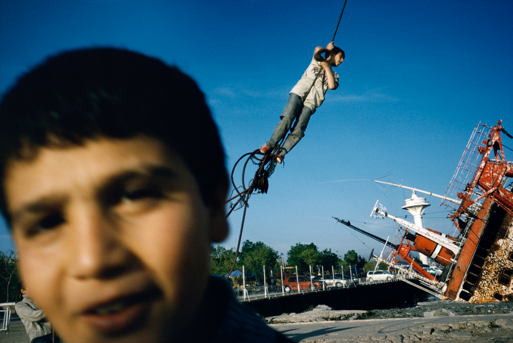

- 原文件名：`Below the Blue Mosque, near the southern entrance of the Bosporus. Children playing on a grounded ship, Istanbul, Turkey. 2004..jpeg`
- 新文件名：`01-alex-webb-istanbul-turkey-2004-grounded-ship.jpeg`
- 作者：Alex Webb。地点：伊斯坦布尔，土耳其。拍摄年份：2004。
- 状态：**同图确认**。
- 核对说明：原图 IPTC/EXIF 记载蓝色清真寺附近、博斯普鲁斯海峡南端、搁浅船上玩耍的儿童；画廊另以钢缆上的男孩作识别描述。
- 原图 IPTC 说明：TURKEY. Istanbul. 2004. Below the Blue Mosque, near the southern entrance of the Bosporus. Children playing on a grounded ship.
- 官网同图说明：2004
- 摄影师官网：Istanbul: City of 100 Names，展示图 2：[摄影师官网：Istanbul: City of 100 Names，展示图 2](https://webbnorriswebb.co/book/alex/istanbul-city-of-100-names?id=2)
- 官网同图文件：[官网同图文件](https://cdn.sanity.io/images/o985varc/production/c5dca10b9b1c894284a806d062f825cc768ee41d-2987x2000.jpg)
- 文件：5229 × 3500 px；6,341,322 bytes。
- SHA-256：`c30a7ed4e9081b7b84d9b7c1a648f9ded6f335ac1ab982b996032acf991bb07f`。

### 02 · 泳池边的女孩

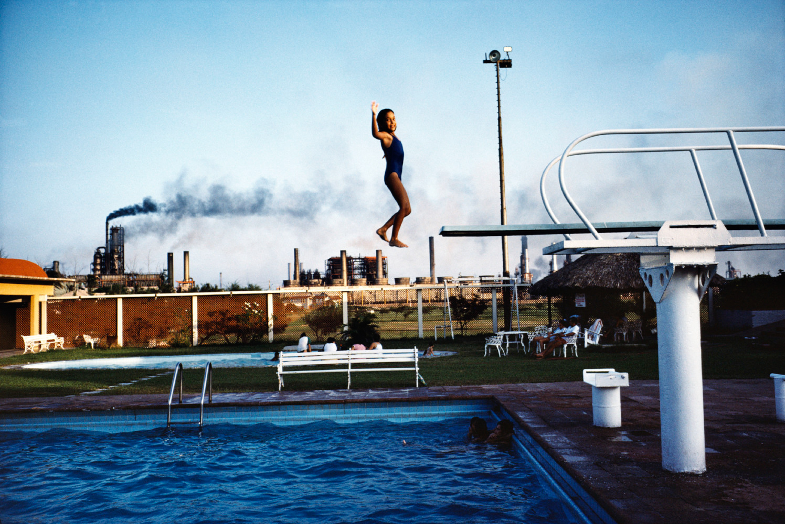

- 原文件名：`Ciudad Madero, Mexico. 1983..jpeg`
- 新文件名：`02-alex-webb-ciudad-madero-mexico-1983-pool.jpeg`
- 作者：Alex Webb。地点：Ciudad Madero，墨西哥。拍摄年份：1983。
- 状态：**同图确认**。
- 核对说明：拍摄年份采用摄影师官网和原文件名一致的 1983；不能把其他页面的印制年份或异版年份直接用作拍摄年份。
- 原图 IPTC 说明：MEXICO. 1983.
- 官网同图说明：Ciudad Madero, Mexico, 1983
- 摄影师官网：La Calle，展示图 3：[摄影师官网：La Calle，展示图 3](https://webbnorriswebb.co/book/alex/la-calle?id=3)
- 官网同图文件：[官网同图文件](https://cdn.sanity.io/images/o985varc/production/31e72bfba4d97abe49c81fc4ddae0663f5b3e4e7-2993x2000.jpg)
- 文件：5236 × 3500 px；7,128,621 bytes。
- SHA-256：`4acd6474dcc05edba52138f81bc08fbc8b16fd5bf580c9a00d0f3982096d75ee`。

### 03 · 罗切斯特街头

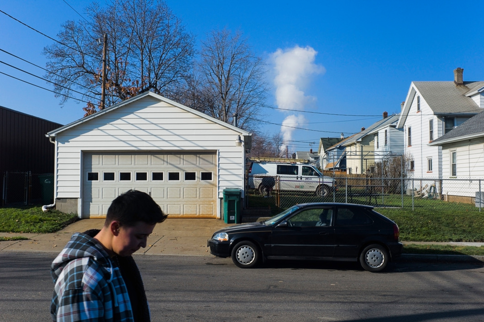

- 原文件名：`NYC131747.jpeg`
- 新文件名：`03-alex-webb-rochester-new-york-2012-street.jpeg`
- 作者：Alex Webb。地点：罗切斯特，纽约州，美国。拍摄年份：2012。
- 状态：**元数据确认；未找到同图网页**。
- 核对说明：原图 IPTC 说明注明 November, 2012；采用说明中的拍摄年份，不把文件处理时间当作拍摄时间。未找到同图公开页面。
- 原图 IPTC 说明：USA. Rochester, NY. November, 2012.
- 项目背景：Visual Studies Workshop · Memory City（未确认本图）：[项目背景：Visual Studies Workshop · Memory City（未确认本图）](https://www.vsw.org/exhibition/memory-city/)
- 文件：5260 × 3500 px；5,889,393 bytes。
- SHA-256：`59a8c5a79e07e3e3d594565a435f995757ab86aaf9ae89ae79c17d7be1c765d4`。

### 04 · 市中心清晨

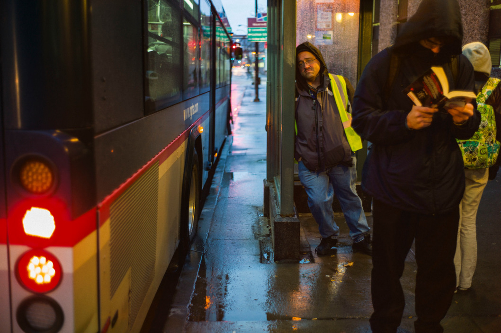

- 原文件名：`NYC133909.jpeg`
- 新文件名：`04-alex-webb-rochester-new-york-2013-downtown-morning.jpeg`
- 作者：Alex Webb。地点：罗切斯特，纽约州，美国。拍摄年份：2013。
- 状态：**元数据确认；未找到同图网页**。
- 核对说明：原图 IPTC 说明注明 2013、Downtown early morning。未找到同图公开页面。
- 原图 IPTC 说明：USA. Rochester, NY. 2013. Downtown early morning.
- 项目背景：Visual Studies Workshop · Memory City（未确认本图）：[项目背景：Visual Studies Workshop · Memory City（未确认本图）](https://www.vsw.org/exhibition/memory-city/)
- 文件：5260 × 3500 px；5,193,391 bytes。
- SHA-256：`700a9a83cc3bd63bf1adf56c78f596b84cc09c7541f2f37b5cd06757387d31d1`。

### 05 · 旅鸽标本景箱

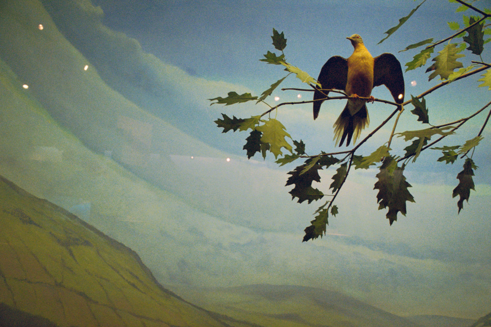

- 原文件名：`NYC151488.jpeg`
- 新文件名：`05-rebecca-norris-webb-rochester-new-york-2013-passenger-pigeon-diorama.jpeg`
- 作者：Rebecca Norris Webb。地点：罗切斯特科学博物馆，纽约州，美国。拍摄年份：2013。
- 状态：**同图确认**。
- 核对说明：原图 IPTC 作者字段及画廊同图一致指向 Rebecca Norris Webb；不能署名为 Alex Webb。
- 原图 IPTC 说明：(Photo by Rebecca Norris Webb / distributed by Magnum Photos.)  USA. Rochester, NY. 2013. Extinct Passenger Pigeon diorama at the Rochester Museum and Science Center.
- Robert Koch Gallery：单幅作品：[Robert Koch Gallery：单幅作品](https://kochgallery.com/artists/rebecca-norris-webb/extinct-passenger-pigeon-diorama-rochester-museum-and-science-center_id2279/)
- 文件：5240 × 3500 px；7,051,521 bytes。
- SHA-256：`7f9101d2908e5a99173c1e3624dc42fbc4293b740e6a8c0f19b9c3dcaeed3160`。

### 06 · 主庭院附近的骑车者

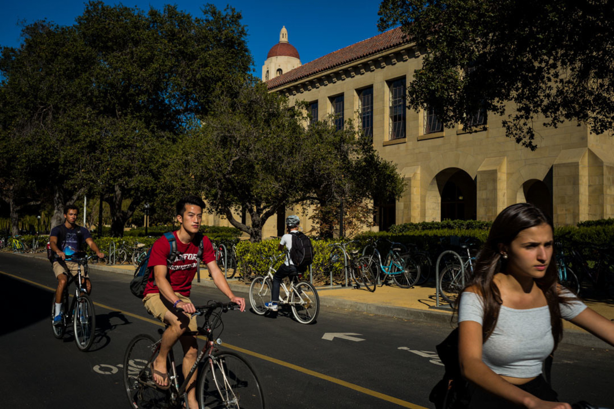

- 原文件名：`Stanford Bikers near Quad. California, USA. 2015..jpeg`
- 新文件名：`06-alex-webb-stanford-california-2015-bikers-near-quad.jpeg`
- 作者：Alex Webb。地点：斯坦福大学，加利福尼亚州，美国。拍摄年份：2015。
- 状态：**元数据确认；未找到同图网页**。
- 核对说明：作者、场景和 2015 年来自原图 IPTC。斯坦福官方项目报道可确认 Alex Webb 的 2015 年校园拍摄，但未找到本图同图页。
- 原图 IPTC 说明：USA. California. 2015. Stanford Bikers near Quad.
- 项目背景：Stanford 官方报道（未确认本图）：[项目背景：Stanford 官方报道（未确认本图）](https://news.stanford.edu/stories/2016/05/new-anniversary-book-celebrates-stanford-125-years)
- 文件：5243 × 3500 px；6,118,274 bytes。
- SHA-256：`611c4eba78778c52ebc58190a9b04e4f6490ee19cd969577062618e2a42f5637`。

### 07 · 斯坦福主庭院

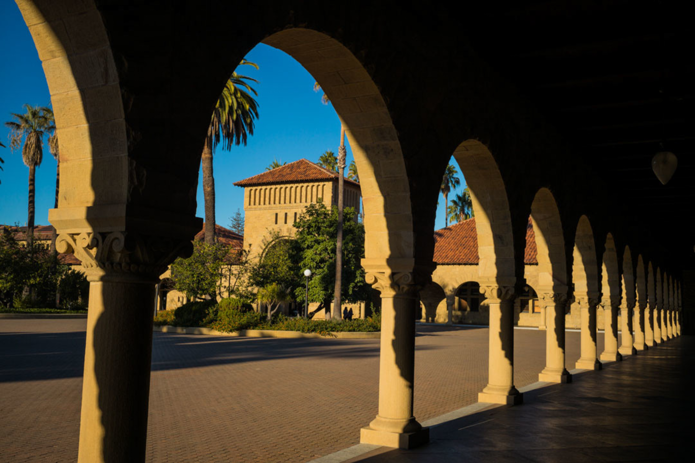

- 原文件名：`Stanford Quad. California, USA. 2015..jpeg`
- 新文件名：`07-alex-webb-stanford-california-2015-quad.jpeg`
- 作者：Alex Webb。地点：斯坦福大学，加利福尼亚州，美国。拍摄年份：2015。
- 状态：**元数据确认；未找到同图网页**。
- 核对说明：作者、场景和 2015 年来自原图 IPTC。项目书于 2016 年出版，拍摄于 2015 年；未找到本图同图页。
- 原图 IPTC 说明：USA. California. 2015. Stanford Quad.
- 项目背景：Stanford 官方报道（未确认本图）：[项目背景：Stanford 官方报道（未确认本图）](https://news.stanford.edu/stories/2016/05/new-anniversary-book-celebrates-stanford-125-years)
- 文件：5243 × 3500 px；4,715,556 bytes。
- SHA-256：`b79bca5abfb7b86223701d929310c0385277c189f62f361423bfbd28bec86ce9`。

### 08 · 斯坦福大学乐队

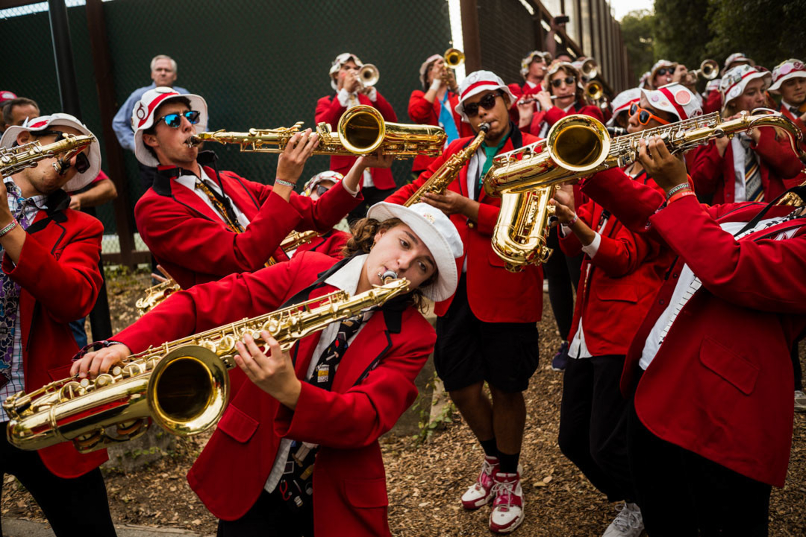

- 原文件名：`Stanford University Band. California, USA. 2015..jpeg`
- 新文件名：`08-alex-webb-stanford-california-2015-university-band.jpeg`
- 作者：Alex Webb。地点：斯坦福大学，加利福尼亚州，美国。拍摄年份：2015。
- 状态：**元数据确认；未找到同图网页**。
- 核对说明：作者、场景和 2015 年来自原图 IPTC。斯坦福官方报道作为项目背景，不作为本图同图证据。
- 原图 IPTC 说明：USA. California, 2015. Stanford University Band.
- 项目背景：Stanford 官方报道（未确认本图）：[项目背景：Stanford 官方报道（未确认本图）](https://news.stanford.edu/stories/2016/05/new-anniversary-book-celebrates-stanford-125-years)
- 文件：5243 × 3500 px；6,052,699 bytes。
- SHA-256：`8e53d599d1c8124aeeaf2490dd8041a196a641bdadf29a48f68faa43a92a071b`。

### 09 · 街头泡泡与亲子

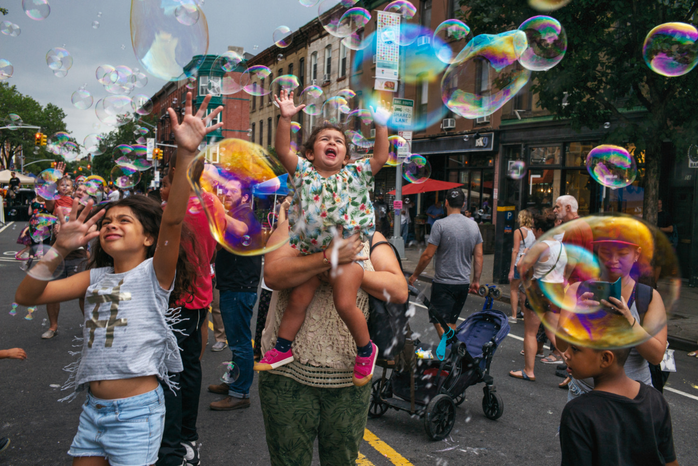

- 原文件名：`USA. Brooklyn, NY. 2018. Park Slope..jpeg`
- 新文件名：`09-alex-webb-park-slope-brooklyn-2018-bubbles.jpeg`
- 作者：Alex Webb。地点：Park Slope，布鲁克林，纽约，美国。拍摄年份：2018。
- 状态：**同图确认**。
- 核对说明：已与来源中的同一画面比对；地点和年份按来源说明记录。
- 原图 IPTC 说明：USA. Brooklyn, NY. 2018. Park Slope.
- 官网同图说明：Park Slope, 2018 (AW)
- 摄影师官网：Brooklyn: The City Within，展示图 5：[摄影师官网：Brooklyn: The City Within，展示图 5](https://webbnorriswebb.co/book/alex/brooklyn-the-city-within?id=5)
- 官网同图文件：[官网同图文件](https://cdn.sanity.io/images/o985varc/production/d44631859b6161fd5cd669ed6441675b0fd4ce40-2994x2000.jpg)
- 文件：5240 × 3500 px；6,815,308 bytes。
- SHA-256：`ec07e1271540d911ea84c10016a50c38f740fa18d8d7ccc6327ff506fd6f170b`。

### 10 · 院落里玩耍的儿童

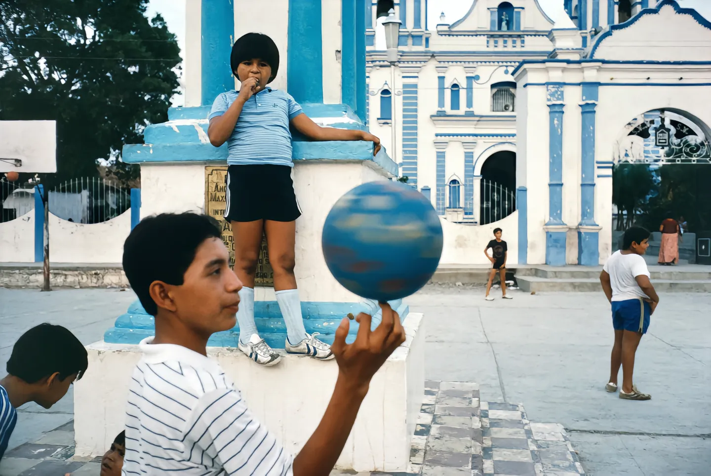

- 原文件名：`mmexport1746449156384.webp`
- 新文件名：`10-alex-webb-tehuantepec-mexico-1985-children.webp`
- 作者：Alex Webb。地点：Tehuantepec，Oaxaca，墨西哥。拍摄年份：1985。
- 状态：**同图确认**。
- 核对说明：已与来源中的同一画面比对；地点和年份按来源说明记录。
- 官网同图说明：Tehuantepec, Mexico, 1985
- 摄影师官网：La Calle，展示图 10：[摄影师官网：La Calle，展示图 10](https://webbnorriswebb.co/book/alex/la-calle?id=10)
- 官网同图文件：[官网同图文件](https://cdn.sanity.io/images/o985varc/production/1bcb7f094834a0ea6379ca0f1b46e6692fd63db9-2989x2000.jpg)
- 文件：1440 × 964 px；132,208 bytes。
- SHA-256：`7d4027d186335a0fdd91be971017cd017661ba46ad00a1da0eeecd10902398a4`。

### 11 · 登记处的拥抱

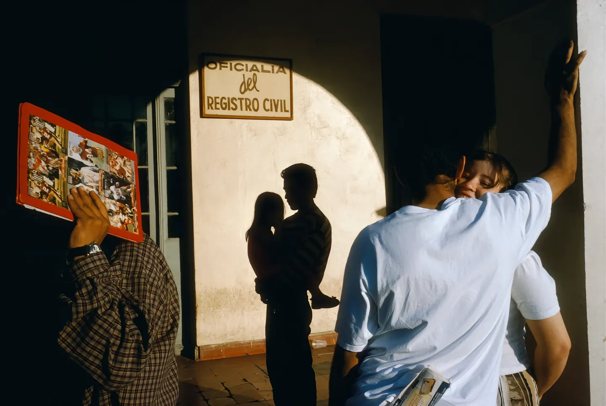

- 原文件名：`mmexport1746449160556.webp`
- 新文件名：`11-alex-webb-nuevo-laredo-mexico-1996-registry-office.webp`
- 作者：Alex Webb。地点：Nuevo Laredo，Tamaulipas，墨西哥。拍摄年份：1996。
- 状态：**同图确认**。
- 核对说明：已与来源中的同一画面比对；地点和年份按来源说明记录。
- 官网同图说明：Nuevo Laredo, Mexico, 1996
- 摄影师官网：La Calle，展示图 6：[摄影师官网：La Calle，展示图 6](https://webbnorriswebb.co/book/alex/la-calle?id=6)
- 官网同图文件：[官网同图文件](https://cdn.sanity.io/images/o985varc/production/fe5f1a841b00eb4fc0dab29afe73674a770d7544-2988x2000.jpg)
- Magnum Photos：单幅作品：[Magnum Photos：单幅作品](https://store.magnumphotos.com/products/nuevo-laredo-tamaulipas-mexico-1996)
- 文件：1440 × 964 px；86,050 bytes。
- SHA-256：`eedb7f0fc49e6708527b85135694daccc0a5a3fadca04c1f5dec3c0cd592e7a0`。

### 12 · Gouyave 酒吧

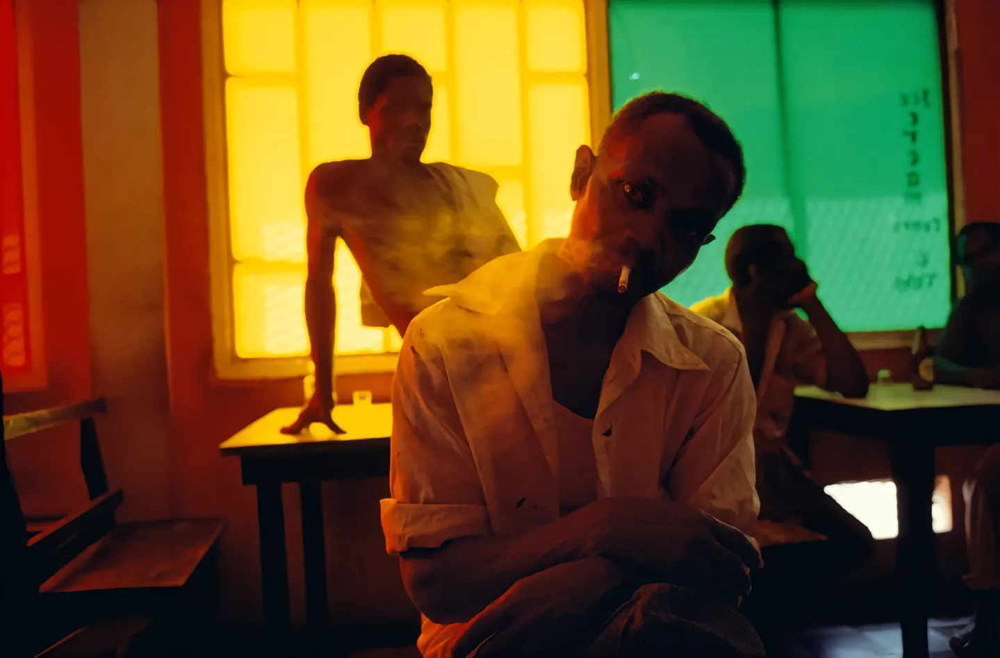

- 原文件名：`mmexport1746449161658.webp`
- 新文件名：`12-alex-webb-gouyave-grenada-1979-bar.webp`
- 作者：Alex Webb。地点：Gouyave，格林纳达。拍摄年份：1979。
- 状态：**同图确认**。
- 核对说明：已与来源中的同一画面比对；地点和年份按来源说明记录。
- 官网同图说明：Grenada, 1979
- 摄影师官网：The Suffering of Light，展示图 2：[摄影师官网：The Suffering of Light，展示图 2](https://webbnorriswebb.co/book/alex/the-suffering-of-light?id=2)
- 官网同图文件：[官网同图文件](https://cdn.sanity.io/images/o985varc/production/ae194e284d2584c28aaa8e9937672bb9480c8732-3035x2000.jpg)
- Centre Pompidou：馆藏记录：[Centre Pompidou：馆藏记录](https://www.centrepompidou.fr/en/ressources/oeuvre/cazeoo)
- 文件：1439 × 948 px；46,264 bytes。
- SHA-256：`986e4363f8891182c51982770a62bbe5ebba71f765237bcde4609313374c35f1`。

### 13 · 擦鞋摊的镜面与街道

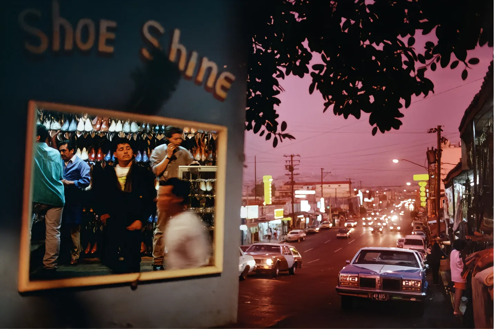

- 原文件名：`mmexport1746449163175.webp`
- 新文件名：`13-alex-webb-tijuana-mexico-1991-shoeshine-mirror.webp`
- 作者：Alex Webb。地点：Tijuana，Baja California，墨西哥。拍摄年份：1991。
- 状态：**同图确认**。
- 核对说明：已与来源中的同一画面比对；地点和年份按来源说明记录。
- 官网同图说明：Tijuana, Mexico, 1991
- 摄影师官网：Crossings，展示图 10：[摄影师官网：Crossings，展示图 10](https://webbnorriswebb.co/book/alex/crossings?id=10)
- 官网同图文件：[官网同图文件](https://cdn.sanity.io/images/o985varc/production/7a57bb3923da1fc224d782ea521284fb5a0c0e4f-3000x2000.jpg)
- 文件：1433 × 956 px；103,764 bytes。
- SHA-256：`d161d47d69bb2cbf6c4caee0b0e82f6294c2c31c5ee9bbff89cee767f649bd1c`。

### 14 · 红墙与柱廊

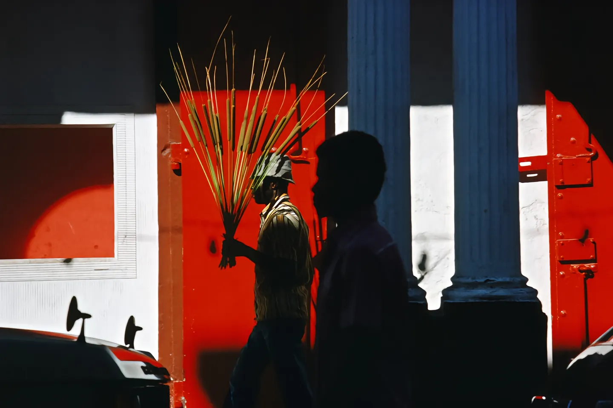

- 原文件名：`mmexport1746449164638.webp`
- 新文件名：`14-alex-webb-port-au-prince-haiti-1979-red-wall.webp`
- 作者：Alex Webb。地点：太子港，海地。拍摄年份：1979。
- 状态：**同图确认**。
- 核对说明：已与来源中的同一画面比对；地点和年份按来源说明记录。
- 官网同图说明：Port-au-Prince, Haiti, 1979
- 摄影师官网：Hot Light / Half-Made Worlds，展示图 2：[摄影师官网：Hot Light / Half-Made Worlds，展示图 2](https://webbnorriswebb.co/book/alex/hot-light-half-made-worlds?id=2)
- 官网同图文件：[官网同图文件](https://cdn.sanity.io/images/o985varc/production/154198c8341da00915967a1f92d58e305e1d9f8b-3001x2000.jpg)
- 文件：1440 × 960 px；59,776 bytes。
- SHA-256：`183886f822baa14845ab3b6287a8ea20ae10f47b49cb15a784ff3cd41eb5e163`。

### 15 · 安大略湖舞厅

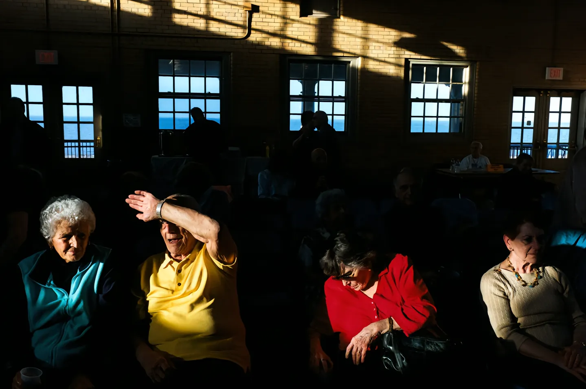

- 原文件名：`mmexport1746449168800.webp`
- 新文件名：`15-alex-webb-rochester-new-york-2013-dance-hall.webp`
- 作者：Alex Webb。地点：罗切斯特，纽约州，美国。拍摄年份：2013。
- 状态：**同图确认**。
- 核对说明：摄影师官网同图标注 Rochester, 2013 (AW)；画廊补充舞厅与安大略湖信息。
- 官网同图说明：Rochester, N.Y., 2013 (A.W.)
- 摄影师官网：Memory City，展示图 15：[摄影师官网：Memory City，展示图 15](https://webbnorriswebb.co/book/alex/memory-city?id=15)
- 官网同图文件：[官网同图文件](https://cdn.sanity.io/images/o985varc/production/afbe5b98e729af9b2c3ff35a264e2b0cfb01eefc-3006x2000.jpg)
- Robert Koch Gallery：单幅作品：[Robert Koch Gallery：单幅作品](https://kochgallery.com/artists/alex-webb/dance-hall-lake-ontario_id2222/)
- 文件：1439 × 958 px；81,224 bytes。
- SHA-256：`c6d4db68a6954dc7a877a49d776c35bfcf69e535eedeed63400e325eba10f301`。

### 16 · 纸箱中的孩子

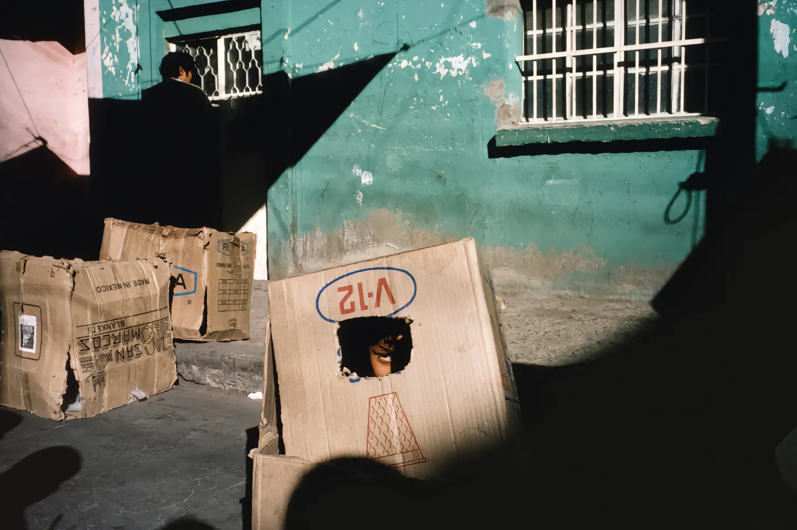

- 原文件名：`mmexport1746449169916.webp`
- 新文件名：`16-alex-webb-leon-mexico-1987-cardboard-box.webp`
- 作者：Alex Webb。地点：León，Guanajuato，墨西哥。拍摄年份：1987。
- 状态：**同图确认**。
- 核对说明：已与来源中的同一画面比对；地点和年份按来源说明记录。
- 官网同图说明：Leon, Mexico, 1987
- 摄影师官网：La Calle，展示图 4：[摄影师官网：La Calle，展示图 4](https://webbnorriswebb.co/book/alex/la-calle?id=4)
- 官网同图文件：[官网同图文件](https://cdn.sanity.io/images/o985varc/production/8b319d8272697fb4ec8a70e16a7c0a4205909e51-3002x2000.jpg)
- 文件：1440 × 959 px；94,220 bytes。
- SHA-256：`b6ed148cdc1e570f770387fde587e127cb2ff28859bbbe88aaffdf245ebb3933`。

### 17 · Flying Squirrels 社区中心

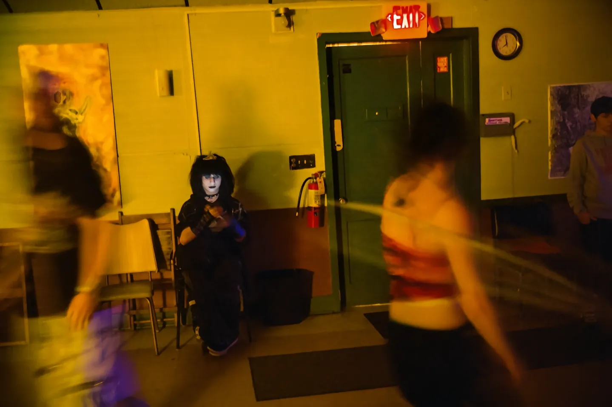

- 原文件名：`mmexport1746449171654.webp`
- 新文件名：`17-alex-webb-rochester-new-york-2013-flying-squirrels.webp`
- 作者：Alex Webb。地点：Corn Hill，罗切斯特，纽约州，美国。拍摄年份：2013。
- 状态：**同图确认**。
- 核对说明：画廊同图标题与年份明确；罗切斯特地点结合 Memory City 系列背景确认。
- Robert Koch Gallery：单幅作品：[Robert Koch Gallery：单幅作品](https://kochgallery.com/artists/alex-webb/flying-squirrels-community-center-corn-hill_id2226/)
- 文件：1439 × 958 px；51,128 bytes。
- SHA-256：`96c0a0a74e76bd0cd7566d684f3c96673ab92ed510b7470c7a072ad560af3fa8`。

### 18 · Open Door Mission 生日庆祝

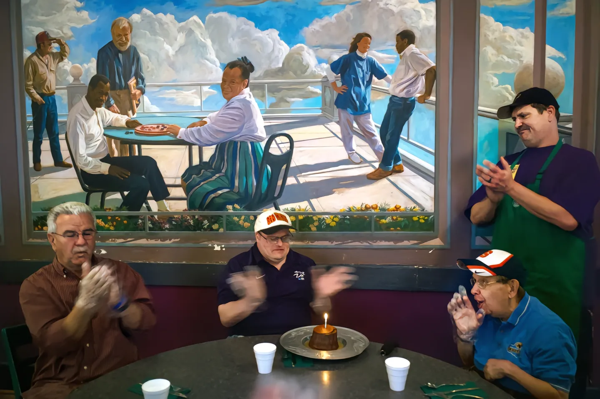

- 原文件名：`mmexport1746449172883.webp`
- 新文件名：`18-alex-webb-rochester-new-york-2012-open-door-mission.webp`
- 作者：Alex Webb。地点：Plymouth Street，罗切斯特，纽约州，美国。拍摄年份：2012。
- 状态：**同图确认**。
- 核对说明：画廊同图注明 Open Door Mission、Plymouth St.、2012；“生日庆祝”为画面识别描述。
- Robert Koch Gallery：单幅作品：[Robert Koch Gallery：单幅作品](https://kochgallery.com/artists/alex-webb/open-door-mission-plymouth-st_id2227/)
- 文件：1439 × 958 px；111,694 bytes。
- SHA-256：`838346d902aba5b3796249a9acc5c21e4a592eef43fe035714aa788eaf2e1c17`。

### 19 · 巨眼广告与街头人群

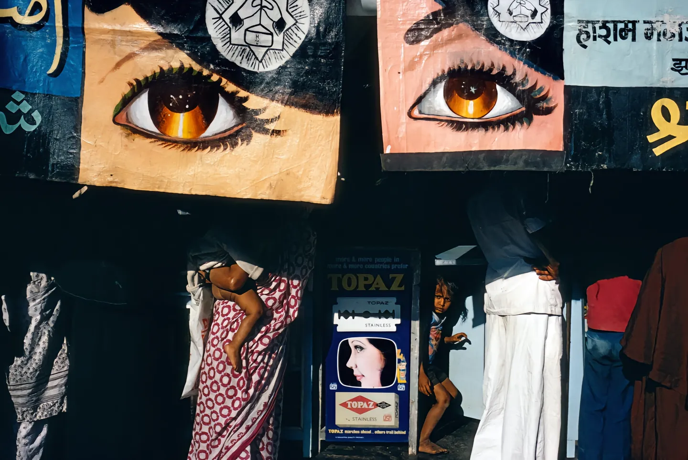

- 原文件名：`mmexport1746449174488.webp`
- 新文件名：`19-alex-webb-bombay-india-1981-eyes-banner.webp`
- 作者：Alex Webb。地点：Bombay（现 Mumbai），印度。拍摄年份：1981。
- 状态：**同图确认**。
- 核对说明：已与来源中的同一画面比对；地点和年份按来源说明记录。
- 官网同图说明：Bombay, India, 1981
- 摄影师官网：Hot Light / Half-Made Worlds，展示图 5：[摄影师官网：Hot Light / Half-Made Worlds，展示图 5](https://webbnorriswebb.co/book/alex/hot-light-half-made-worlds?id=5)
- 官网同图文件：[官网同图文件](https://cdn.sanity.io/images/o985varc/production/ef311ddbdffb0590b2722e9de747e7019e418909-2987x2000.jpg)
- 文件：1440 × 964 px；145,992 bytes。
- SHA-256：`ea6e3c8b72ff4e123da5be629cdaf0a2dbbe263dd8997c4ac67dbd2c074ec7b5`。

### 20 · 蓝墙前的男孩

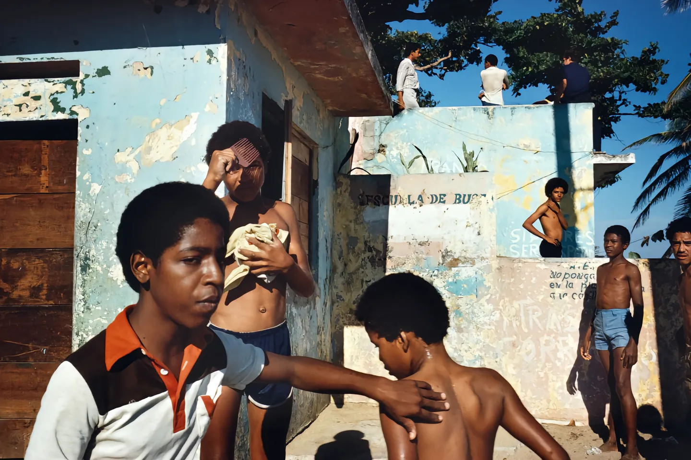

- 原文件名：`mmexport1746449175219.webp`
- 新文件名：`20-alex-webb-santo-domingo-dominican-republic-1980-boys.webp`
- 作者：Alex Webb。地点：Santo Domingo，多米尼加共和国。拍摄年份：1980。
- 状态：**同图确认**。
- 核对说明：已与来源中的同一画面比对；地点和年份按来源说明记录。
- 官网同图说明：Santo Domingo, Dominican Republic, 1980
- 摄影师官网：Hot Light / Half-Made Worlds，展示图 4：[摄影师官网：Hot Light / Half-Made Worlds，展示图 4](https://webbnorriswebb.co/book/alex/hot-light-half-made-worlds?id=4)
- 官网同图文件：[官网同图文件](https://cdn.sanity.io/images/o985varc/production/9c41f6e057a562fda6dfe07b1285f2227ecf01e8-3000x2000.jpg)
- 文件：1440 × 960 px；154,790 bytes。
- SHA-256：`1be5a3fe11049519461ce57daeb6b295577cfde934c589cc50e2d72b503976b8`。

### 21 · 海边与船桅

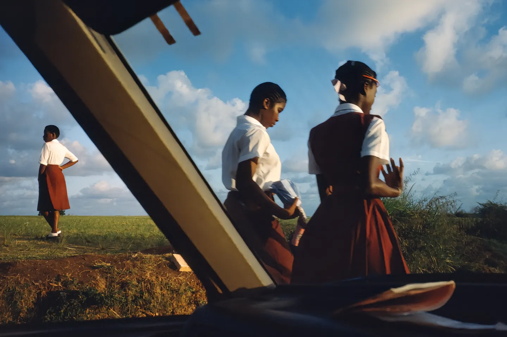

- 原文件名：`mmexport1746449178717.webp`
- 新文件名：`21-alex-webb-bridgetown-barbados-1983-seaside.webp`
- 作者：Alex Webb。地点：Bridgetown，巴巴多斯。拍摄年份：1983。
- 状态：**同图确认**。
- 核对说明：已与来源中的同一画面比对；地点和年份按来源说明记录。
- 官网同图说明：Barbados, 1983
- 摄影师官网：Hot Light / Half-Made Worlds，展示图 3：[摄影师官网：Hot Light / Half-Made Worlds，展示图 3](https://webbnorriswebb.co/book/alex/hot-light-half-made-worlds?id=3)
- 官网同图文件：[官网同图文件](https://cdn.sanity.io/images/o985varc/production/56c07a8149b703d15d720ca30b5a1ef1c695eaed-3008x2000.jpg)
- Robert Koch Gallery：单幅作品：[Robert Koch Gallery：单幅作品](https://kochgallery.com/artists/alex-webb/bridgetown-barbados_id2238/)
- 文件：1439 × 957 px；77,384 bytes。
- SHA-256：`3151b211b621d713f267e03fffd1f1b1398046068b0fbdcdf5d3e23996fd8f07`。

### 22 · 鱼头装扮的儿童

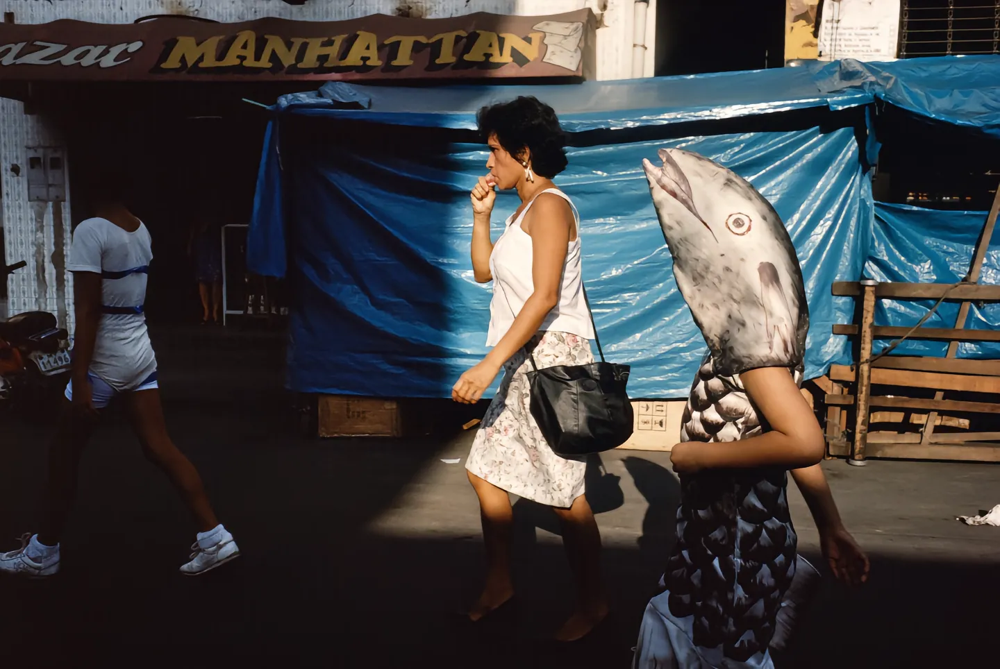

- 原文件名：`mmexport1746449181536.webp`
- 新文件名：`22-alex-webb-iquitos-peru-1993-fish-costume.webp`
- 作者：Alex Webb。地点：Iquitos，秘鲁。拍摄年份：1993。
- 状态：**同图确认**。
- 核对说明：同图来源指向 Iquitos, Peru, 1993；不是伊斯坦布尔。
- 官网同图说明：Iquitos, Peru, 1993
- 摄影师官网：Amazon: From the Floodplains to the Clouds，展示图 9：[摄影师官网：Amazon: From the Floodplains to the Clouds，展示图 9](https://webbnorriswebb.co/book/alex/amazon-from-the-floodplains-to-the-clouds?id=9)
- 官网同图文件：[官网同图文件](https://cdn.sanity.io/images/o985varc/production/435edaae073c7574b8024eb1bcba453f2ef55074-2987x2000.jpg)
- 文件：1440 × 964 px；105,850 bytes。
- SHA-256：`699996f5e621bef88b9dcca538984be9c1e2bd0c6b7c8de66c58c87d089411e3`。

### 23 · 游乐场里的儿童

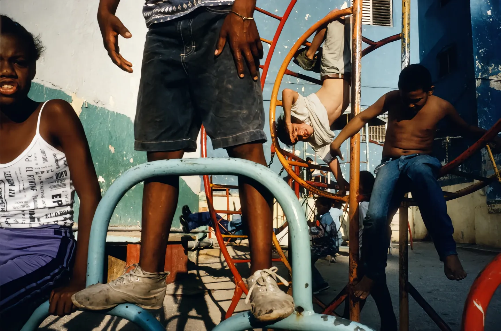

- 原文件名：`mmexport1746449184253.webp`
- 新文件名：`23-alex-webb-havana-cuba-2000-playground.webp`
- 作者：Alex Webb。地点：哈瓦那，古巴。拍摄年份：2000。
- 状态：**同图确认**。
- 核对说明：这是 Havana, 2000 的游乐场作品，与第 32 张攀爬架照片不同。
- 官网同图说明：Havana, Cuba, 2000 (A.W.)
- 摄影师官网：Violet Isle: A Duet of Photographs from Cuba，展示图 4：[摄影师官网：Violet Isle: A Duet of Photographs from Cuba，展示图 4](https://webbnorriswebb.co/book/alex/violet-isle-a-duet-of-photographs-from-cuba?id=4)
- 官网同图文件：[官网同图文件](https://cdn.sanity.io/images/o985varc/production/ac9513ecf969aa8b16e936e3f07ffee7be6f41be-3020x2000.jpg)
- 文件：1439 × 953 px；143,340 bytes。
- SHA-256：`6276fbc55a21c268bfd9da0070fb341759f3a81ceb8f6e16ee3dab86816d681f`。

### 24 · 绿色房间里的镜子

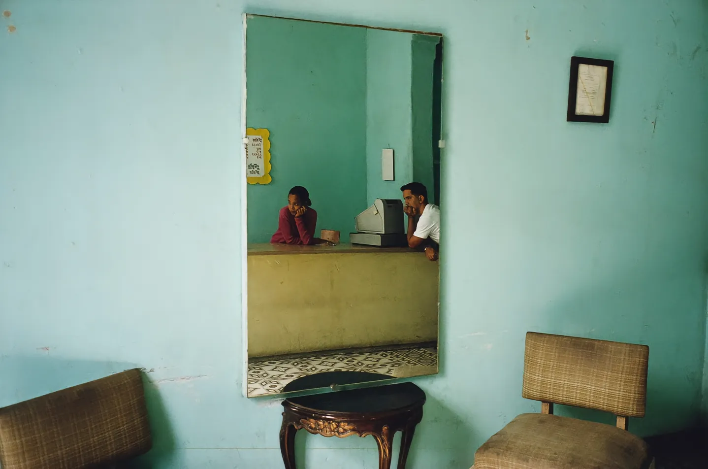

- 原文件名：`mmexport1746449185705.webp`
- 新文件名：`24-alex-webb-regla-havana-cuba-2007-mirror.webp`
- 作者：Alex Webb。地点：Regla，哈瓦那，古巴。拍摄年份：2007。
- 状态：**同图确认**。
- 核对说明：已与来源中的同一画面比对；地点和年份按来源说明记录。
- 官网同图说明：Regla, Havana, Cuba, 2007 (A.W.)
- 摄影师官网：Violet Isle: A Duet of Photographs from Cuba，展示图 12：[摄影师官网：Violet Isle: A Duet of Photographs from Cuba，展示图 12](https://webbnorriswebb.co/book/alex/violet-isle-a-duet-of-photographs-from-cuba?id=12)
- 官网同图文件：[官网同图文件](https://cdn.sanity.io/images/o985varc/production/0b777e1beb3e7dc734fb1fea40578f517d7520ff-3020x2000.jpg)
- 文件：1438 × 952 px；54,408 bytes。
- SHA-256：`4080917ee26d4bfe16b048859a66fa5dc497bf0577830550ecbfec703e32a5fe`。

### 25 · 蓝色房间与镜中男子

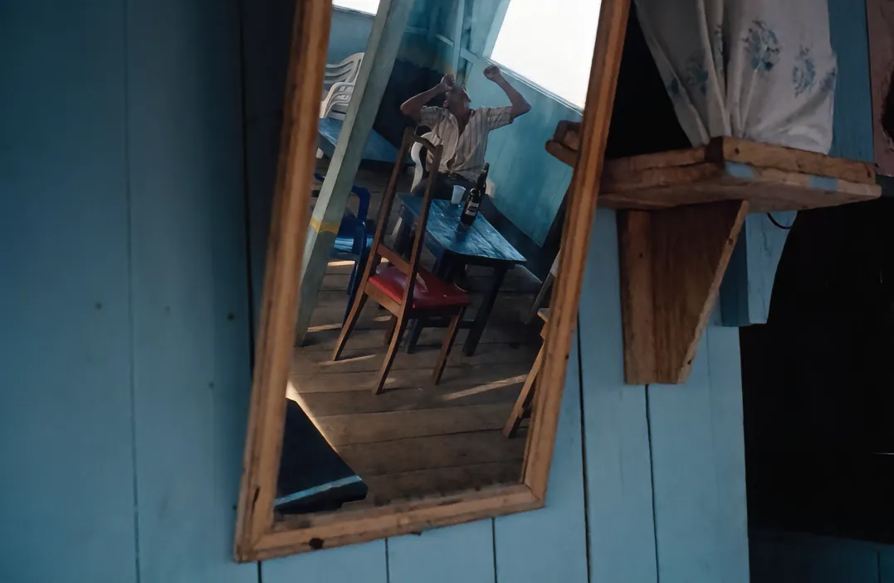

- 原文件名：`mmexport1746449186739.webp`
- 新文件名：`25-unverified-blue-room-mirror.webp`
- 作者：待核实。地点：待核实。拍摄年份：待核实。
- 状态：**待核实**。
- 核对说明：没有可用的作者/地点/年份元数据，未找到可靠同图来源。文件名仅描述画面，不据风格推断作者。
- 已检索：摄影师官网作品集：[已检索：摄影师官网作品集](https://webbnorriswebb.co/)
- 已检索：Robert Klein Gallery 作品目录：[已检索：Robert Klein Gallery 作品目录](https://www.robertkleingallery.com/artists/61-alex-webb/works/)
- 已检索：Robert Koch Gallery 作品目录：[已检索：Robert Koch Gallery 作品目录](https://kochgallery.com/artists/alex-webb/)
- 已检索：Magnum 作者页：[已检索：Magnum 作者页](https://www.magnumphotos.com/photographer/alex-webb/)
- 文件：1077 × 704 px；31,550 bytes。
- SHA-256：`363cc5559ff1f09a90d2ef3f52c4e63e2ceeff7eda12f58e45c653cc7865e27f`。

### 26 · 橙色窗框与咖啡馆倒影

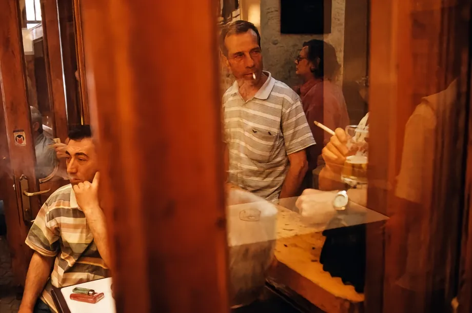

- 原文件名：`mmexport1746449188416.webp`
- 新文件名：`26-unverified-orange-cafe-reflections.webp`
- 作者：待核实。地点：待核实。拍摄年份：待核实。
- 状态：**待核实**。
- 核对说明：未找到可靠同图来源。不能仅凭咖啡馆场景推断为伊斯坦布尔或 Alex Webb 作品。
- 已检索：摄影师官网作品集：[已检索：摄影师官网作品集](https://webbnorriswebb.co/)
- 已检索：Robert Klein Gallery 作品目录：[已检索：Robert Klein Gallery 作品目录](https://www.robertkleingallery.com/artists/61-alex-webb/works/)
- 已检索：Robert Koch Gallery 作品目录：[已检索：Robert Koch Gallery 作品目录](https://kochgallery.com/artists/alex-webb/)
- 已检索：Magnum 作者页：[已检索：Magnum 作者页](https://www.magnumphotos.com/photographer/alex-webb/)
- 文件：920 × 610 px；38,144 bytes。
- SHA-256：`27ac9ef5efe84cb462f6951eedfbb244898d1052e170bfdcdedc376940b43a9d`。

### 27 · 倒挂的儿童

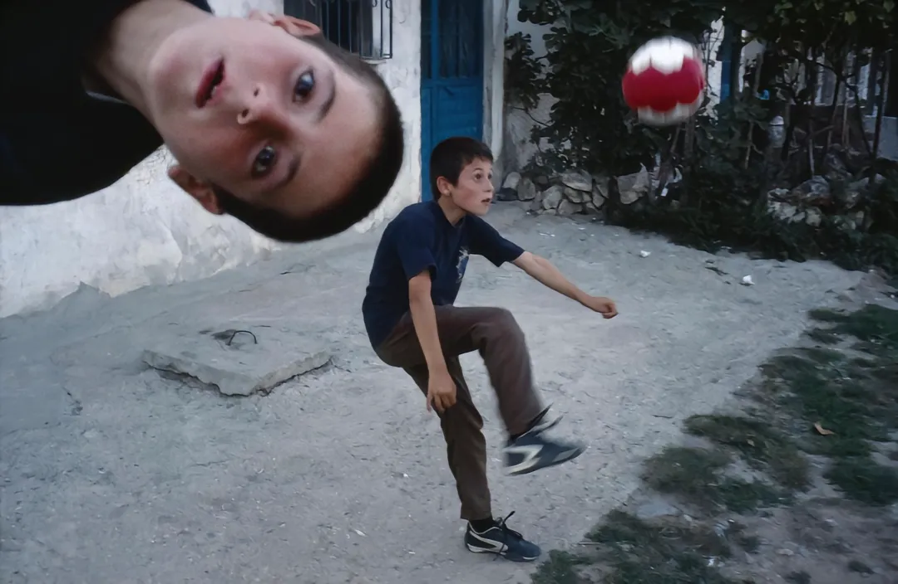

- 原文件名：`mmexport1746449190089.webp`
- 新文件名：`27-alex-webb-altinsehir-istanbul-turkey-2004-upside-down-child.webp`
- 作者：Alex Webb。地点：Altınşehir，伊斯坦布尔，土耳其。拍摄年份：2004。
- 状态：**同图确认**。
- 核对说明：画廊同图注明 Altinsehir、Istanbul、2004。
- Robert Klein Gallery：单幅作品：[Robert Klein Gallery：单幅作品](https://www.robertkleingallery.com/artists/61-alex-webb/works/16505-alex-webb-istanbul-upside-down-child-altinsehir-2004/)
- 文件：1080 × 704 px；56,420 bytes。
- SHA-256：`d55d7994836700006bbe2647772666434401d64b74541bea195ebe58141caedb`。

### 28 · 棉花糖与女孩

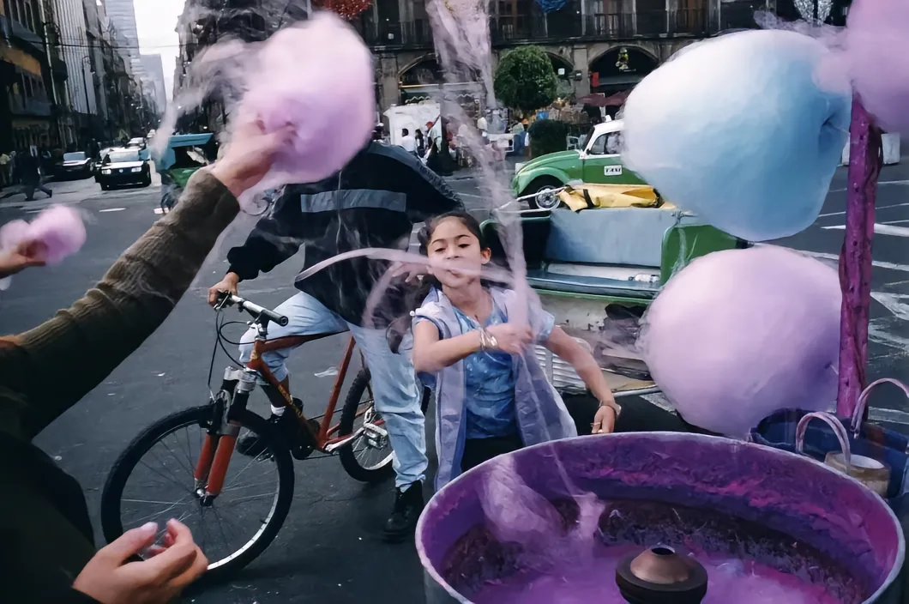

- 原文件名：`mmexport1746449193138.webp`
- 新文件名：`28-alex-webb-mexico-city-2003-cotton-candy.webp`
- 作者：Alex Webb。地点：墨西哥城，墨西哥。拍摄年份：2003。
- 状态：**同图确认**。
- 核对说明：已与来源中的同一画面比对；地点和年份按来源说明记录。
- Robert Klein Gallery：单幅作品：[Robert Klein Gallery：单幅作品](https://www.robertkleingallery.com/artists/61-alex-webb/works/17394-alex-webb-mexico-city-girl-with-cotton-candy-2003/)
- 文件：1060 × 704 px；82,754 bytes。
- SHA-256：`1c592c29cb358401d68ba87ab55bb4622643c8fa9be2de2c3529d483f0670d41`。

### 29 · Süleymaniye 咖啡馆

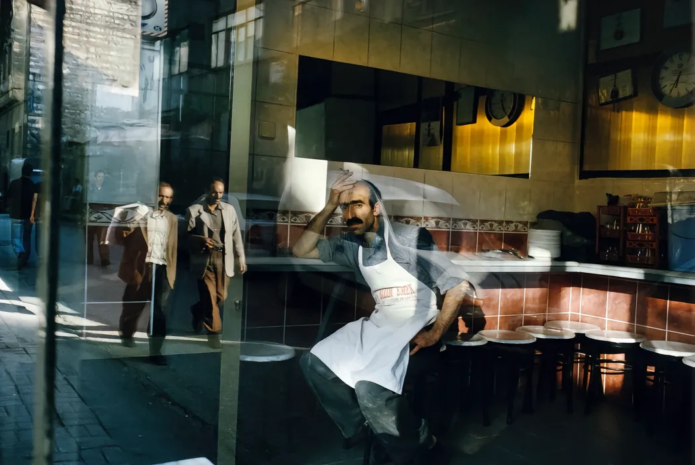

- 原文件名：`mmexport1746449194644.webp`
- 新文件名：`29-alex-webb-suleymaniye-istanbul-turkey-2004-cafe.webp`
- 作者：Alex Webb。地点：Süleymaniye，伊斯坦布尔，土耳其。拍摄年份：2004。
- 状态：**同图确认**。
- 核对说明：Magnum 专题同图说明为 Suleymaniye cafe、Istanbul、2004；画廊版本的裁切和色调不同。
- Magnum Photos：Istanbul 作品专题：[Magnum Photos：Istanbul 作品专题](https://www.magnumphotos.com/arts-culture/alex-webb-city-of-hundred-names/)
- Stephen Bulger Gallery：单幅作品：[Stephen Bulger Gallery：单幅作品](https://www.bulgergallery.com/artists/85-alex-webb/works/9286-alex-webb-suleymaniye-2004/)
- 文件：1051 × 704 px；64,388 bytes。
- SHA-256：`8ae038db4b1d23bbcec080e1df12853c966e918cf99113510d503a8a8b8c8a79`。

### 30 · 红色公交车

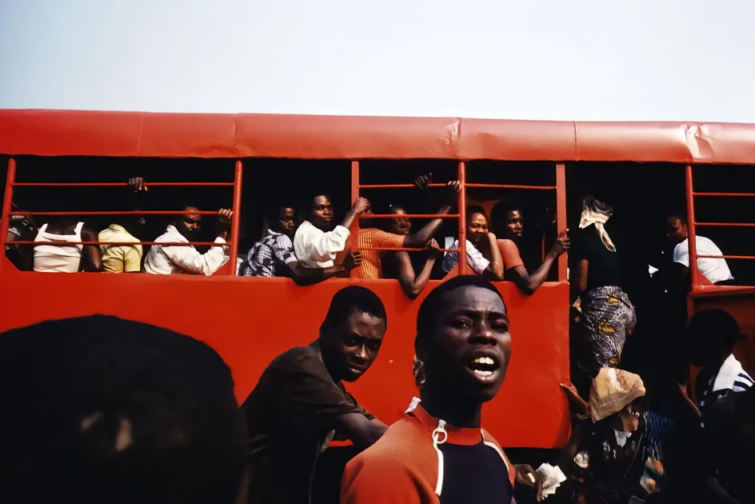

- 原文件名：`mmexport1746449195793.webp`
- 新文件名：`30-alex-webb-kinshasa-zaire-1982-red-bus.webp`
- 作者：Alex Webb。地点：Kinshasa，扎伊尔（现刚果民主共和国）。拍摄年份：1982。
- 状态：**同图确认**。
- 核对说明：官网同图说明原拼写为 Kinshasha, Zaire (Congo), 1982；文件名规范写作 Kinshasa，保留拍摄时国名背景。
- 官网同图说明：Kinshasha, Zaire (Congo), 1982
- 摄影师官网：Hot Light / Half-Made Worlds，展示图 10：[摄影师官网：Hot Light / Half-Made Worlds，展示图 10](https://webbnorriswebb.co/book/alex/hot-light-half-made-worlds?id=10)
- 官网同图文件：[官网同图文件](https://cdn.sanity.io/images/o985varc/production/49037403ae72b38e8de4153caeb47454f64cb8da-2999x2000.jpg)
- 文件：944 × 630 px；37,130 bytes。
- SHA-256：`4d8116af3b756f2adfb83d36ff01d346a68c6c2eb1017f703cd31bcf054e6c80`。

### 31 · 海边的人群与帆船

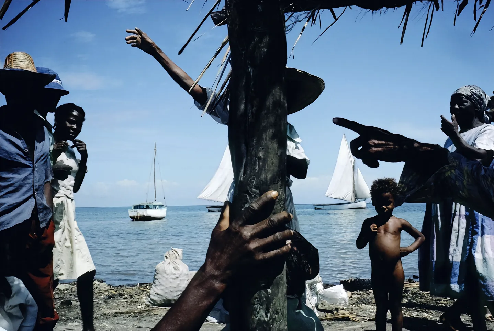

- 原文件名：`mmexport1746449199203.webp`
- 新文件名：`31-alex-webb-etroits-la-gonave-haiti-1986-seaside.webp`
- 作者：Alex Webb。地点：Étroits，La Gonâve，海地。拍摄年份：1986。
- 状态：**同图确认**。
- 核对说明：已与来源中的同一画面比对；地点和年份按来源说明记录。
- 官网同图说明：Etroits, La Gonave, Haiti, 1986
- 摄影师官网：Under a Grudging Sun，展示图 4：[摄影师官网：Under a Grudging Sun，展示图 4](https://webbnorriswebb.co/book/alex/under-a-grudging-sun?id=4)
- 官网同图文件：[官网同图文件](https://cdn.sanity.io/images/o985varc/production/ce124b5b8a180a820d6f6af0585dbb122156c95d-2985x2000.jpg)
- 文件：1438 × 964 px；136,114 bytes。
- SHA-256：`552b39888d9b6e0423920da5dd4fdf4704cdc2a0e24132dc6b61a9f00cc76004`。

### 32 · 攀爬架上的儿童

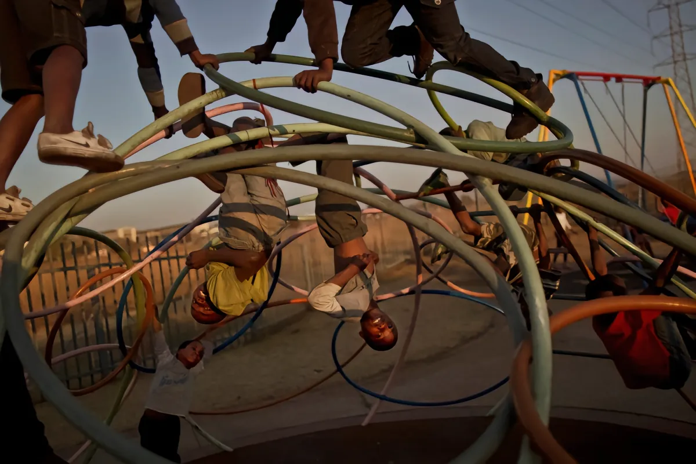

- 原文件名：`mmexport1746449201102.webp`
- 新文件名：`32-unverified-playground-dome.webp`
- 作者：待核实。地点：待核实。拍摄年份：待核实。
- 状态：**待核实**。
- 核对说明：未找到可靠同图来源。保留独立编号，不将第 23 张的作者、地点和年份套用到本图。
- 已检索：摄影师官网作品集：[已检索：摄影师官网作品集](https://webbnorriswebb.co/)
- 已检索：Robert Klein Gallery 作品目录：[已检索：Robert Klein Gallery 作品目录](https://www.robertkleingallery.com/artists/61-alex-webb/works/)
- 已检索：Robert Koch Gallery 作品目录：[已检索：Robert Koch Gallery 作品目录](https://kochgallery.com/artists/alex-webb/)
- 已检索：Magnum 作者页：[已检索：Magnum 作者页](https://www.magnumphotos.com/photographer/alex-webb/)
- 文件：1200 × 800 px；69,682 bytes。
- SHA-256：`f307f26e89db6cd4aab021af8d8939094d0405e429463212026ec3b35f3a6317`。

### 33 · 蓝白柱廊前的儿童

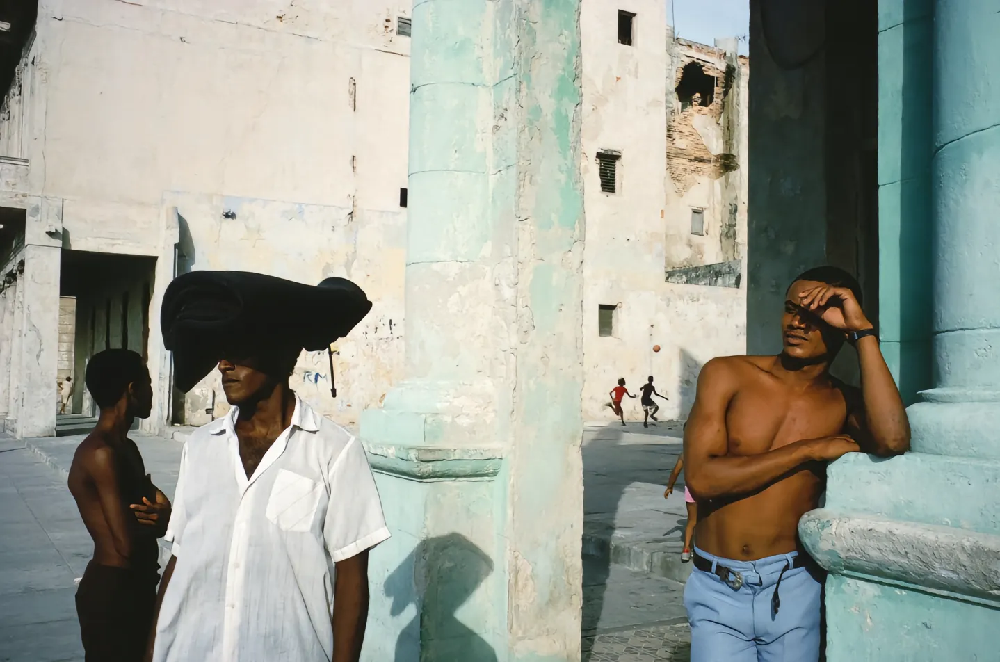

- 原文件名：`mmexport1746449202598.webp`
- 新文件名：`33-alex-webb-havana-cuba-1993-blue-columns.webp`
- 作者：Alex Webb。地点：哈瓦那，古巴。拍摄年份：1993。
- 状态：**同图确认**。
- 核对说明：已与来源中的同一画面比对；地点和年份按来源说明记录。
- Robert Klein Gallery：单幅作品：[Robert Klein Gallery：单幅作品](https://www.robertkleingallery.com/artists/61-alex-webb/works/17634-alex-webb-havana-cuba-1993/)
- 文件：1438 × 952 px；93,122 bytes。
- SHA-256：`1c641353aa7f5af7725139599ff9182b957338478264c24b4ab43f44bcbec7ba`。

### 34 · 彩色墙前的男孩

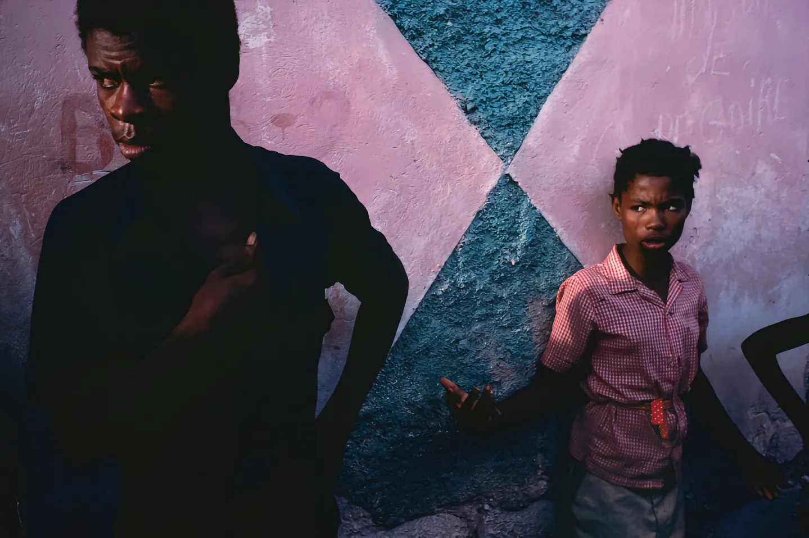

- 原文件名：`mmexport1746449203877.webp`
- 新文件名：`34-alex-webb-port-au-prince-haiti-1987-color-wall.webp`
- 作者：Alex Webb。地点：太子港，海地。拍摄年份：1987。
- 状态：**同图确认**。
- 核对说明：已与来源中的同一画面比对；地点和年份按来源说明记录。
- Robert Koch Gallery：单幅作品：[Robert Koch Gallery：单幅作品](https://kochgallery.com/artists/alex-webb/port-au-prince-haiti_id2243/)
- 文件：1439 × 958 px；111,184 bytes。
- SHA-256：`77ef26835ea7930ba898cc2301f88ab4a443f2fca822ffb53f9f5457da0a3ede`。

### 35 · 携镜子的商贩

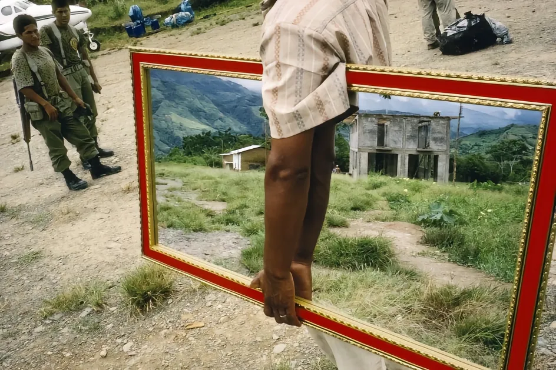

- 原文件名：`mmexport1746449207680.webp`
- 新文件名：`35-alex-webb-palmapampa-peru-1993-mirror-vendor.webp`
- 作者：Alex Webb。地点：Palmapampa，秘鲁。拍摄年份：1993。
- 状态：**同图确认**。
- 核对说明：已与来源中的同一画面比对；地点和年份按来源说明记录。
- 官网同图说明：Palmapampa, Peru, 1993
- 摄影师官网：Amazon: From the Floodplains to the Clouds，展示图 7：[摄影师官网：Amazon: From the Floodplains to the Clouds，展示图 7](https://webbnorriswebb.co/book/alex/amazon-from-the-floodplains-to-the-clouds?id=7)
- 官网同图文件：[官网同图文件](https://cdn.sanity.io/images/o985varc/production/5a1a49c3f4496f6ae7a0125ae31e00a5718784d7-2999x2000.jpg)
- 文件：944 × 629 px；128,964 bytes。
- SHA-256：`56ac5c5ed6eb53c1baf8cb74ff6099aad4828da41a9b011d37de5a0df94fabc8`。

## 待核实条目检索记录

| 编号 | 画面线索 | 已用文字检索方向 | 尚缺证据 |
|---|---|---|---|
| 25 | 蓝色木板房、斜放镜子、镜中男子、酒瓶 | Alex Webb + mirror / blue room / bar / Brazil / Amazon | 可对应画面的作品页及作者、地点、年份说明 |
| 26 | 橙色木框玻璃、条纹衫男子、咖啡馆与倒影 | Alex Webb + Istanbul / cafe / reflections / striped shirt | 可对应画面的作品页及作者、地点、年份说明 |
| 32 | 圆顶金属攀爬架、多名倒挂儿童 | Alex Webb + playground / climbing dome / upside down / Istanbul | 可对应画面的作品页及作者、地点、年份说明 |

除文字联网检索外，已将公开作品目录中的候选图与本地图片比对；未取得可靠匹配的条目继续标记待核实。Google 反向搜图的文件上传被浏览器安全检查拒绝，未完成该上传检索。
